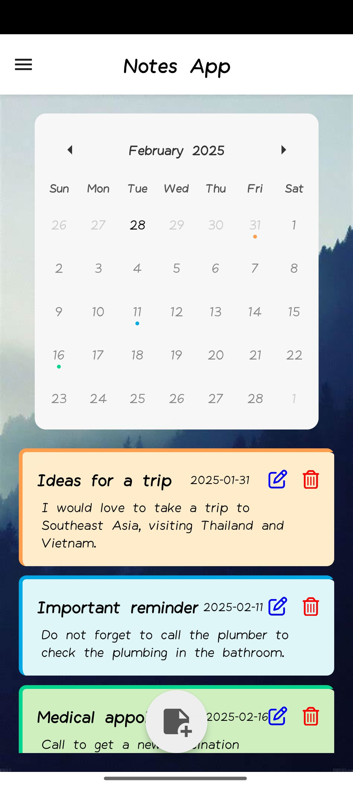
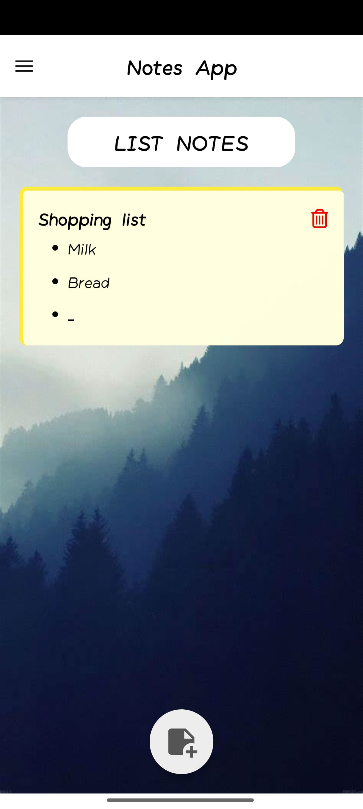
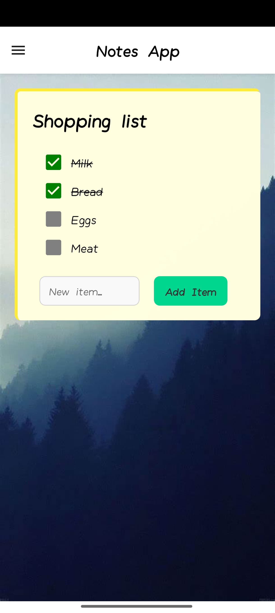
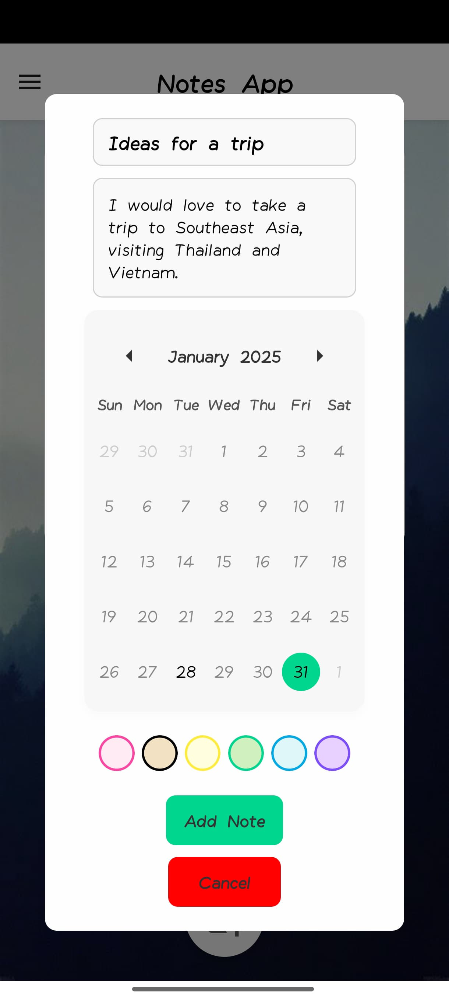

# Notes App

## Description

Notes App is a mobile application developed with React Native and Expo that allows you to create and manage notes in a personalised and organised way. 

With Notes App you can create notes with title, description, date, colours and other customisable aspects. You can also organise your notes in lists with infinite elements. No internet connection required.

## Main features

* **Create personalised notes:**  Define the title, description, date, colours and other details of your notes.
* **Offline operation:** Access your notes and lists anytime, anywhere, even without an internet connection.
* **Lists for better organisation:** Create lists with infinite items to organise your tasks.
* **Customize the wallpaper:** Give your app a personal touch by changing the wallpaper from the options included.

## Screenshots / GIFs






## Installation

Notes App is developed with React Native and Expo. To install and run it, follow these steps:

1.  **Make sure you have Node.js installed on your system.**
2.  **Clone this repository.**
3.  **Install the dependencies:**
    ```bash
    npm install
    ```
4.  **Start the application:**
    ```bash
    npx expo start
    ```

## Running the application

You can run the application in two ways:

*   **Using Expo:** Follow the instructions that appear in the terminal after executing `npx expo start`. You will be able to run the app on an emulator or on your mobile device using the Expo Go app.
*   **Compiling the application:** You can compile the application to get an APK file and install it on your Android device. Or you can download the latest version of the APK here: https://drive.google.com/file/d/1uTr0dHp3kGTeX-dJGTP7-EmUDayjYCjC/view?usp=drivesdk

> **Disclaimer:** Additional software and other programs may be required to install and run the App correctly, e.g. Android Studio, EAS, etc. Please review the Expo documentation to run and compile the App correctly.


## Who the Notes App is for

Notes App is ideal for anyone looking for a local notes app with advanced customisation and organisation features, and that does not require an internet connection.

## Licence

This project is under the MIT licence.